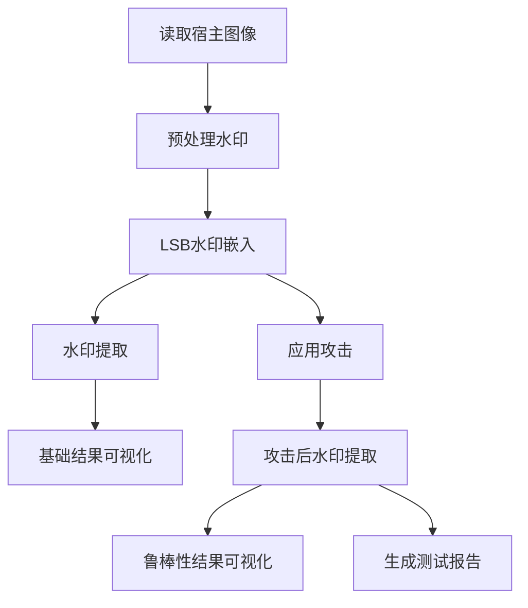

# LSB水印嵌入系统说明文档

## 概述
本系统实现了基于最低有效位(LSB)的数字水印嵌入和提取算法，用于在灰度图像中嵌入和提取水印信息。系统包含水印嵌入、提取、攻击测试和可视化分析等功能模块。

## 项目结构

```text
lsb-watermarking/
├── output_images/                  # 输出目录
│   ├── embedding_results.png       # 嵌入结果
│   ├── robustness_results.png      # 鲁棒性测试结果
│   ├── background.png              # 原始宿主图像
│   ├── watermark.png               # 处理后的水印
│   ├── synthesis.png               # 含水印图像
│   └── extract_watermark.png       # 提取的水印
├── host_image.png                  # 宿主图像（用户提供）
├── watermark.png                   # 水印图像（用户提供）
├── lsb_watermark.py                # 主程序
└── README.md                       # 说明文档
```


## 数学原理

### 位平面分解
对于8位灰度图像，每个像素值 $I$ 可表示为：
$$I = \sum_{k=0}^{7} b_k \cdot 2^k$$
其中 $b_k \in \{0,1\}$ 是第k位平面的值。

位平面提取公式：
$$b_k = \left\lfloor \frac{I}{2^k} \right\rfloor \mod 2$$

### LSB水印嵌入
设宿主图像为 $H$，水印图像为 $W$，嵌入位数为 $n$：

1. 取水印的高 $n$ 位：
   $$W_{\text{high}} = W \gg (8 - n)$$

2. 清除宿主图像的低 $n$ 位：
   $$H_{\text{cleared}} = H \land \text{0xFF} \ll n$$

3. 合成图像：
   $$S = H_{\text{cleared}} \lor W_{\text{high}}$$

### LSB水印提取
从合成图像 $S$ 中提取水印：

1. 提取低 $n$ 位：
   $$E_{\text{low}} = S \land (2^n - 1)$$

2. 重构水印：
   $$W' = E_{\text{low}} \ll (8 - n)$$

## 系统架构

### 主要模块
1. **LSB嵌入类(LSB_Embed)**：
   - `get_bitPlane()`: 图像位平面分解
   - `lsb_embed()`: 水印嵌入
   - `lsb_extract()`: 水印提取

2. **攻击模块(apply_attacks)**：
   - 7种图像处理攻击
   - 模拟实际应用中的图像处理操作

3. **可视化模块**：
   - 嵌入结果可视化
   - 鲁棒性测试结果可视化

4. **报告模块**：
   - 生成鲁棒性测试报告

### 工作流程


## 核心算法实现

### 位平面分解
```python
@staticmethod
def get_bitPlane(img):
    h, w = img.shape
    bitPlane = np.zeros(shape=(h, w, 8), dtype=np.uint8)
    for i in range(8):
        flag = 1 << i  # 创建位掩码
        bitplane = img & flag  # 应用位掩码
        bitplane[bitplane != 0] = 1  # 二值化
        bitPlane[..., i] = bitplane
    return bitPlane
```

### 水印嵌入
```python
@staticmethod
def lsb_embed(background, watermark, embed_bit=3):
    # 获取位平面
    bitPlane_background = LSB_Embed.get_bitPlane(background)
    bitPlane_watermark = LSB_Embed.get_bitPlane(watermark)
    
    # 将水印高位信息嵌入到背景低位平面
    for i in range(embed_bit):
        bitPlane_background[0:w_h, 0:w_w, i] = \
            bitPlane_watermark[0:w_h, 0:w_w, (8 - embed_bit) + i]
    
    # 重建合成图像
    synthesis = np.zeros_like(background, dtype=np.uint8)
    for i in range(8):
        synthesis += bitPlane_background[..., i] * (1 << i)
    return synthesis
```

### 攻击类型实现
| 攻击类型   | 实现方式           | 参数            |
| ---------- | ------------------ | --------------- |
| 水平翻转   | `cv2.flip(img, 1)` | -               |
| 垂直翻转   | `cv2.flip(img, 0)` | -               |
| 平移       | `cv2.warpAffine`   | 平移(50,50)像素 |
| 裁剪       | 中心裁剪+缩放      | 裁剪75%区域     |
| 对比度调整 | 线性变换           | α=1.5           |
| 高斯噪声   | 添加随机噪声       | μ=0, σ=25       |
| JPEG压缩   | 编码质量设置       | 质量=50         |

## 实验结果与分析

### 运行结果


可以看到图片的左上角已被嵌入水印

### 运行结果

```python
embed_bit为 3 LSBs...
水印提取...
基础结果...
鲁棒性测试
从 Horizontal Flip中提取水印
从 Vertical Flip中提取水印
从 Translation中提取水印
从 Cropping中提取水印
从 Contrast Adjustment中提取水印
从 Gaussian Noise中提取水印
从 JPEG Compression中提取水印
鲁棒性结果可视化

======================================================================
                    ROBUSTNESS TEST
======================================================================
Test Configuration:
- Embedding bits: 3 LSBs
- Watermark size: 304x262 pixels
- Attacks tested: 7
----------------------------------------------------------------------
Attack Results:
1. HORIZONTAL FLIP     : Watermark flipped horizontally - poor extraction
2. VERTICAL FLIP       : Watermark flipped vertically - poor extraction
3. TRANSLATION         : Watermark position shifted - misaligned extraction
4. CROPPING            : Partial watermark extracted (only visible in remaining area)
5. CONTRAST ADJUSTMENT : Good extraction (LSB layers less affected by contrast changes)
6. GAUSSIAN NOISE      : Significant degradation (noise directly affects LSB layers)
7. JPEG COMPRESSION    : Poor extraction (lossy compression destroys LSB data)
Processing complete. Results saved to:
- embedding_results.png
- robustness_results.png
```

### 鲁棒性测试结果
| 攻击类型   | 提取效果 | 原因分析            |
| ---------- | -------- | ------------------- |
| 水平翻转   | 差       | 水印位置信息丢失    |
| 垂直翻转   | 差       | 水印位置信息丢失    |
| 平移       | 较差     | 水印位置偏移        |
| 裁剪       | 部分提取 | 水印区域被裁剪      |
| 对比度调整 | 好       | LSB层受影响小       |
| 高斯噪声   | 差       | 噪声直接影响LSB层   |
| JPEG压缩   | 差       | 有损压缩破坏LSB数据 |

## 结论与改进方向

### 结论
1. LSB水印算法实现简单，计算效率高
2. 对对比度调整等操作具有较好鲁棒性
3. 对几何攻击(翻转、平移)和压缩攻击敏感
4. 嵌入位数影响不可见性和鲁棒性

### 改进方向
1. **抗几何攻击**：引入同步机制或模板
2. **增强鲁棒性**：结合DCT/DWT变换域嵌入
3. **加密处理**：水印嵌入前进行加密
4. **自适应嵌入**：根据图像内容调整嵌入位置
5. **盲提取**：无需原始图像的水印提取

## 使用说明

### 环境要求
- Python 3.6+
- 依赖库：numpy, opencv-python, matplotlib

### 运行步骤
1. 准备宿主图像(`host_image.png`)和水印图像(`watermark.png`)
2. 创建输出目录：`mkdir output_images`
3. 运行主程序：`python lsb_watermark.py`
4. 查看结果：
   - `output_images/embedding_results.png`：基础结果
   - `output_images/robustness_results.png`：鲁棒性测试
   - 控制台输出测试报告

### 参数调整
```python
# 主程序中可调整参数
embed_bit = 3  # 嵌入位数(1-4)
wm_h, wm_w = int(h * 0.25), int(w * 0.25)  # 水印尺寸比例
```
